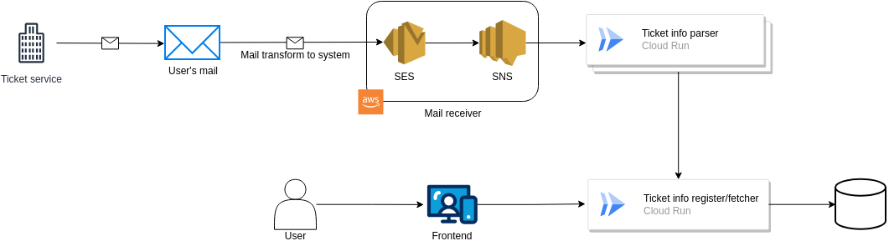

# IMPORTANT

WIPです。
- Forwarder (cloudflare workerで実装でもいいかな、とも。)
- Parser
- Frontend (優先度低め)

がまだ出来上がっていません。
メールのサンプルを収集中のため、ForwarderとParserがWIPになっている感じ。

# eventer-ticket-manage

# 概要

受け取ったチケットサイトのメールを元に、保持している・申し込んだチケットを一元管理するシステムです。
メールでのみではなく、手動でユーザーが登録することも可能としたい(WIP)。

# アーキテクチャ

